# Distributed Transfer — Protocol Sequence Diagrams

One transfer: **move 100 from alice (bank-a) to bob (bank-b)**. Invariant: `alice + bob = 2000`.
Crash markers (💥) correspond exactly to the driver flags you'll use in the scenarios.

---

## 1 · Naive dual-write (`transfer-naive.js`)

Two independent local commits. Nothing coordinates them.

```mermaid
sequenceDiagram
    participant App as App (driver)
    participant A as bank-a (alice)
    participant B as bank-b (bob)

    App->>A: BEGIN&#59; debit alice 100&#59; COMMIT
    A-->>App: committed (durable, visible)
    Note over App: 💥 --crash between-commits
    App->>B: BEGIN&#59; credit bob 100&#59; COMMIT
    B-->>App: committed
```

---

## 2 · Two-phase commit (`transfer-2pc.js` + `recover.js`)

The coordinator's durable log entry is the **commit point** — not any participant's commit.

```mermaid
sequenceDiagram
    participant C as Coordinator
    participant L as Coordinator log (disk)
    participant A as bank-a (alice)
    participant B as bank-b (bob)

    rect rgb(230, 240, 255)
    Note over C,B: Phase 0 — do the work, uncommitted
    C->>A: BEGIN&#59; debit alice 100
    C->>B: BEGIN&#59; credit bob 100
    end

    rect rgb(255, 245, 220)
    Note over C,B: Phase 1 — voting
    C->>A: PREPARE TRANSACTION 'txid'
    A-->>C: YES (survives restart, locks held)
    C->>B: PREPARE TRANSACTION 'txid'
    B-->>C: YES
    Note over C: 💥 --crash after-prepare<br/>(both participants IN-DOUBT)
    end

    rect rgb(230, 250, 230)
    Note over C,B: Phase 2 — decision, then push
    C->>L: write decision=COMMIT  ← THE commit point
    Note over C: 💥 --crash after-decision
    C->>A: COMMIT PREPARED 'txid'
    Note over C: 💥 --crash between-commits
    C->>B: COMMIT PREPARED 'txid'
    end
```

**Recovery rule (`recover.js`):** for each in-doubt txn, if the log has `decision=COMMIT` → roll **forward** (`COMMIT PREPARED`)&#59; no decision on record → **presumed abort** (`ROLLBACK PREPARED`).

**In-doubt:** a participant that voted YES may not commit *or* abort on its own — either unilateral choice could disagree with the coordinator's decision. It holds its locks and waits.

---

## 3 · Saga with compensation (`transfer-saga.js`)

Every step is a **local, committed** transaction. Failure runs compensations backwards.

```mermaid
sequenceDiagram
    participant O as Orchestrator
    participant A as bank-a (alice)
    participant B as bank-b (bob)
    participant R as Concurrent reader (check.js --watch)

    O->>A: T1: BEGIN&#59; debit alice 100&#59; COMMIT
    A-->>O: committed — visible to everyone NOW
    R->>A: read alice
    A-->>R: 900 (total reads 1900!)
    O->>B: T2: credit bob 100
    B--xO: 💥 --fail-step 2 (service down)
    Note over O,A: anomaly window (--comp-delay-ms)<br/>money is "missing" and readers can act on it
    O->>A: C1: BEGIN&#59; re-credit alice 100&#59; COMMIT
    A-->>O: compensated — final state consistent
```

---

## The one-line contrast

| | atomicity | who sees intermediate state | blocking |
|---|---|---|---|
| naive | ✗ none | everyone, possibly forever | none |
| 2PC | ✓ all-or-nothing | no one (locks) | in-doubt participants block |
| saga | ✓ eventually (via compensation) | everyone, during the window | none |
