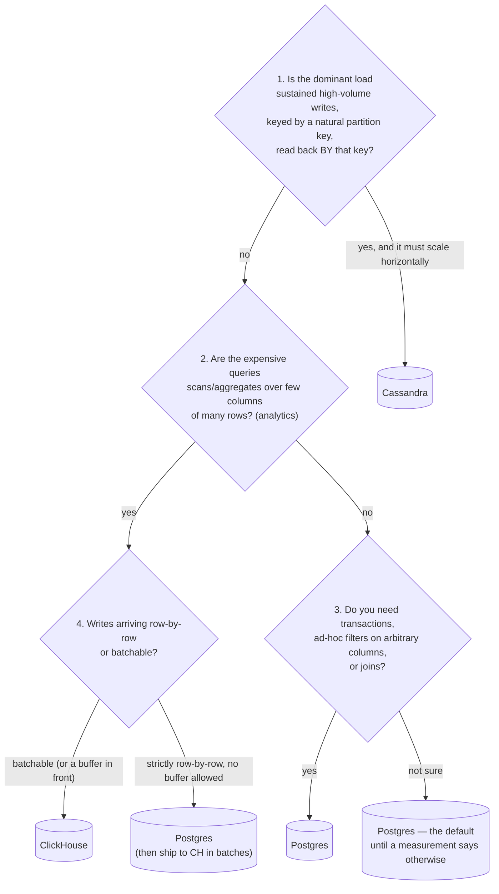

# Session Learnings — Storage Layout Failure Lab

**Date:** 2026-07-10 · **Concept:** *Storage layout determines which workload shape an engine survives.* **Format:** predict → run → compare, driven hands-on. Full evidence + prediction matrix in [`WHY.md`](./WHY.md).

Same 20M rows (`id, user_id, event_type, ts, amount, payload`) in all three engines, `id` as the primary/partition key everywhere. Every number below is measured, not quoted from docs.

---

## TL;DR (one-screen refresh)

- **Postgres (B-tree row store)** won point lookups (1.37ms avg) and *tolerated a 512MB memory cap gracefully* — but a full-column aggregate drags every ~150-200-byte row off the heap to read 20 bytes of it (5,871ms), and without an index a non-key filter is a 6.7s full scan.
- **ClickHouse (columnar MergeTree)** won every full-scan shape by ~14x (aggregate 415ms, non-key filter 478ms) and its sparse index keeps point lookups *respectable* (9.9ms, not scan-slow) — but row-by-row inserts collapse to ~400 writes/sec (fixed per-insert part-creation cost) and it **OOM-crashed** under a memory cap Postgres shrugged off.
- **Cassandra (LSM, partition-addressed)** won sustained random-key writes (~7,200/sec) — but any query that crosses partitions has **no degraded mode**: the full-table aggregate took 4.2 *minutes* client-side, and `ALLOW FILTERING` on a non-key column didn't run slow, it **failed outright**.
- The flip trigger, every time: **does the query cut along the grain the storage layout was organized around, or across it?**

---

## The decision questions

Answer these in order; stop at the first hit.

The longer form, as questions → answers:

| Question you ask about the workload | If the answer is… | Reach for | Because (measured) |
| --- | --- | --- | --- |
| "Will I fetch individual records by a known key?" | yes, and that's most of the load | **Postgres** | 1.37ms avg vs Cassandra 3.56ms, CH 9.9ms (S1). Dense B-tree jumps *to the row*; everything else approximates. |
| "Will I scan millions of rows but only a few columns (SUMs, GROUP BYs, dashboards)?" | yes | **ClickHouse** | 415ms vs Postgres 5,871ms vs Cassandra 252,058ms on the same 20M-row aggregate (S2). Columnar reads only the bytes the query names. |
| "Is the load a firehose of writes keyed by device/user/session, read back by that same key, and does it need to outgrow one node?" | yes | **Cassandra** | Highest sustained random-key throughput (~7,200/s, S3) — and that's *single-node*, where its coordination machinery is pure overhead; the design exists to scale writes linearly by adding nodes. |
| "Will people filter on columns I didn't plan for?" | yes / probably | **Postgres** | An `CREATE INDEX` turned a 6.7s scan into 4ms (S4). CH can't add a B-tree after the fact (ORDER BY is fixed at table creation); Cassandra outright **fails** the query. |
| "Do I need multi-row transactions, constraints, joins?" | yes | **Postgres** | Not measured here — but neither CH nor Cassandra offers them meaningfully. |
| "Is memory/provisioning going to be tight or bursty?" | yes | **Postgres** | Under a 512MB cap: Postgres stable across 3 runs; ClickHouse OOM-killed, *non-deterministically* (S5). PG is built to spill to disk; CH assumes a generous RAM floor for its own internals. |
| "Can I batch the writes (or put Kafka in front)?" | no, and it's high-volume | **not ClickHouse alone** | Row-by-row CH inserts: ~400/s. The same engine ingested 20M rows in one batched insert in ~seconds. The difference is purely amortization of per-insert part creation (S3). |

---

## How reads scale

| | Postgres | ClickHouse | Cassandra |
| --- | --- | --- | --- |
| **Point lookup by key** | **O(log n) B-tree descent, lands on the row.** 1.37ms avg, p99 3.6ms. Stays flat as the table grows (tree depth grows logarithmically). | **Binary search over a sparse index (1 entry per 8,192-row granule), then decompress + linear-scan the whole granule.** 9.9ms avg. Bounded work per lookup — never scan-slow, never index-fast. My prediction said "bloom filter"; wrong — no bloom filter exists unless you declare one. | **Partition-key hash → SSTable(s).** 3.56ms here — beaten by PG because on a single node the coordinator/consistency machinery is overhead with no payoff, and a bulk load leaves multiple SSTables to check per read. Scales *horizontally*: more nodes, same per-lookup cost. |
| **Full scan / aggregate** | Reads **whole rows** even for 2 columns — the 96-byte payload is dragged along on every one of 20M rows. 5,871ms, helped by page cache + parallel workers. Scales with *total table bytes*. | Reads **only the named columns**, compressed. 415ms (~14x). Scales with *bytes of the columns touched* — the gap vs PG widens with wider tables (ours was narrow; the contract's ">50x" needs a fatter schema or a cold cache). | **No server-side path at all** — CQL can't `GROUP BY` a non-key column. Every row crosses the wire to the client: 252,058ms (~4.2 min). Scales with *rows × network*; effectively "don't." |
| **Filter on a non-key column** | Full scan (6,692ms) until you add an index → 100ms cold / **4ms warm** (~1,700x). The escape hatch exists and is cheap. | Always a full column scan (478ms) — fast *because* it's columnar, but no post-hoc index can make it a point read. | Refuses without `ALLOW FILTERING`; with it, on 20M single-row partitions, the read **errored server-side** — no graceful slow mode. If you need a second access path, you build a second table (denormalize), you don't index. |

**Read-scaling one-liner:** Postgres scales reads with *indexes you add later*; ClickHouse scales reads with *how few columns you touch*; Cassandra scales reads only along *the partition key you chose up front* — every other path degrades from slow to impossible.

---

## How writes scale

| | Postgres | ClickHouse | Cassandra |
| --- | --- | --- | --- |
| **Measured (8 writers, 60s, random keys)** | 6,726/s | **231–397/s** row-by-row | **~7,200/s** |
| **Per-write mechanism** | WAL append + B-tree page update. In-place-ish; checkpoints flush dirty pages in the background. | **Every INSERT creates a part on disk** (dir + column files + fsync). Background merges consolidate — live polling showed parts peak at 38 then settle ~10, so merges *kept up*; the cost isn't "too many parts," it's the fixed per-insert overhead itself. | Append to commitlog + memtable; flush to immutable SSTables; compaction later. Writes never seek — this is the LSM bet: pay at compaction/read time instead of write time. |
| **How it scales up** | Vertically; contention on WAL/checkpoints eventually caps a single node. Fine into the tens of thousands/sec territory. | **With batch size, not with concurrency.** Same engine, same table: ~400/s row-by-row vs 20M rows loaded in seconds when batched at 50k. The fix is always batching or a buffer (Kafka) in front. | **Horizontally.** Add nodes, partition space re-shards, write throughput adds roughly linearly. Single-node numbers understate it. |
| **The trap** | Unindexed writes are cheap until checkpoint storms; every index you added for reads is paid for on every write. | Treating it like an OLTP row store. It doesn't error — it just quietly runs at 3% of Postgres's throughput (S3: zero errors, terrible rate). | Batching across partitions (anti-pattern), or choosing a partition key that skews hot. |

---

## Best-fit use cases

| Engine | Reach for it when | Canonical examples | This lab's evidence |
| --- | --- | --- | --- |
| **Postgres** | The workload is *mixed or unknown*; entities fetched/updated by id; ad-hoc queries; transactions; you value surviving bad provisioning | app backend, orders/users/inventory, anything "system of record" | fastest point reads; index = 4ms escape hatch; only engine that never errored or crashed all session |
| **ClickHouse** | Append-heavy analytical data, queries touch few columns of many rows, writes arrive in batches (or via Kafka) | events/telemetry warehouse, dashboards, log analytics — *the sink in our previous streaming lab* | 14x aggregate win; 608x over Cassandra; bounded point-read cost via sparse index |
| **Cassandra** | Write firehose keyed by a natural partition, read back by that key, must scale beyond one node, per-partition access *known up front* | IoT time series per device, chat messages per conversation, user activity feeds | write-throughput winner even single-node; but S2/S4 show the price — off-key access has no slow mode, only failure |

**Anti-cases** (each engine's kryptonite, all observed):
- Postgres: full-column analytics over wide tables → pays for bytes it doesn't need (S2).
- ClickHouse: row-by-row OLTP-style writes (S3) and tight memory (S5 — it *crashes*, it doesn't degrade).
- Cassandra: anything that isn't the partition key — aggregates (S2), filters (S4), even `COUNT(*)` (the verify bug: single count query blew Cassandra's own server-side range timeout).

---

## The interview version (reproduce cold)

> A **row store** (Postgres) organizes bytes around *the row*, so it wins when you want whole records by key and loses when you scan millions of rows for two columns. A **column store** (ClickHouse) organizes bytes around *the column*, so it wins scans/aggregates by an order of magnitude and stays acceptable at point reads via a sparse index — but every insert creates a storage part, so write cost only amortizes in batches. An **LSM partition store** (Cassandra) organizes bytes around *the partition key*, so writes never seek and scale linearly across nodes — but any access path that crosses partitions doesn't degrade, it fails.
>
> The flip trigger is never the engine's quality — it's whether the query cuts **along** the layout's grain or **across** it. Reach for Postgres by default, ClickHouse when the workload is provably "few columns, many rows, batchable writes," Cassandra when it's provably "one partition key, write-heavy, multi-node."

---

## Meta-learnings (about experimenting, not databases)

1. **Instrumentation isn't free** — polling `system.parts` every 2s measurably slowed the run it was watching (397 → 231 writes/s).
2. **A post-hoc snapshot lies** — 7 parts *after* the run said nothing; live polling during it (peak 38 → steady 10) told the real merge story.
3. **`docker update --memory=0` is not a reliable uncap** — it OOM-killed ClickHouse once mid-transition and silently no-opped on Postgres. `docker compose up -d --force-recreate` is the trustworthy reset.
4. **"Everything is zero" is an instrumentation smell, not a data point** — the `crypto.randomInt` 2^48 cap put 100% of writes in the error counter and looked like three broken databases; it was one broken line of harness.
5. **My miss pattern:** both outright-wrong predictions (S1, S5) were about *Cassandra's and ClickHouse's* failure/degradation modes — my Postgres intuitions were consistently the closest. That's the study pointer.
